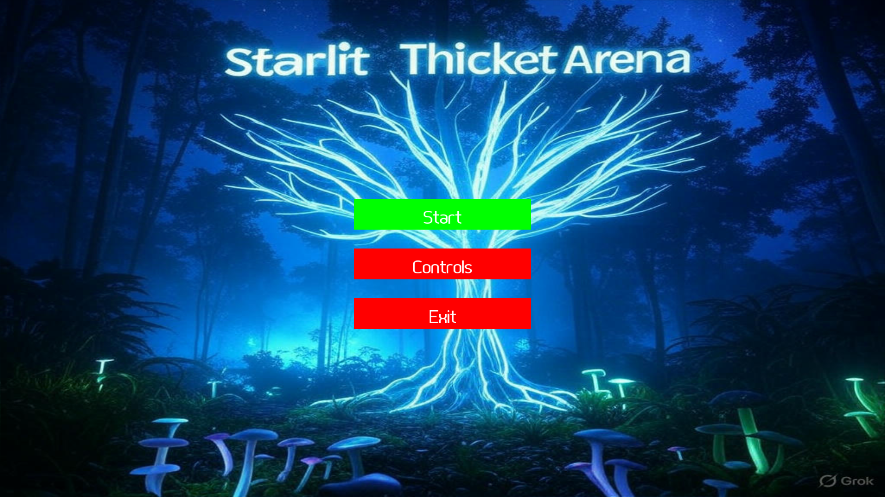
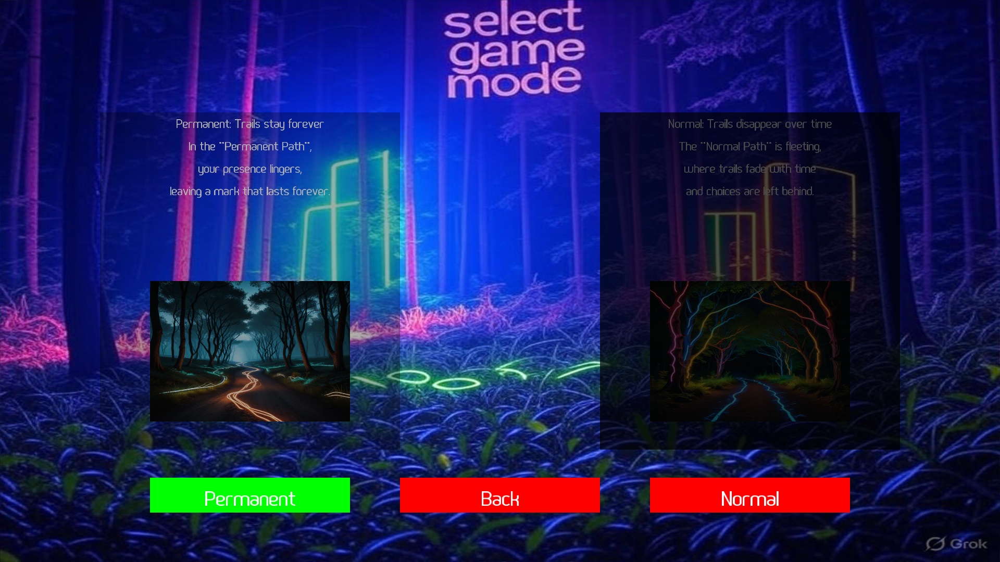
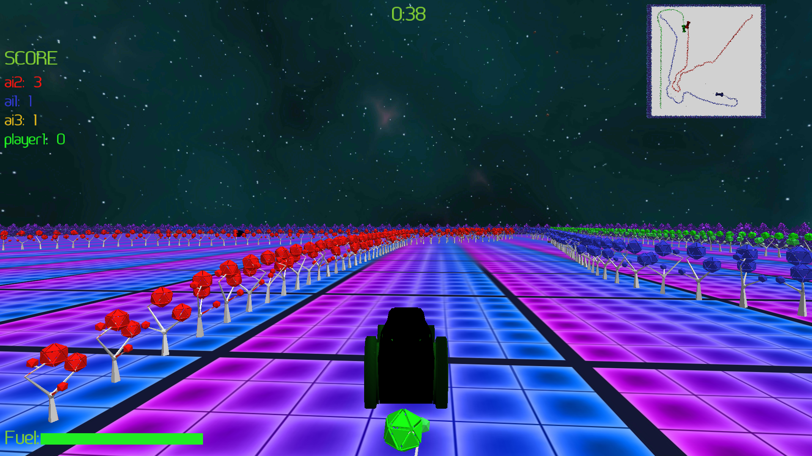
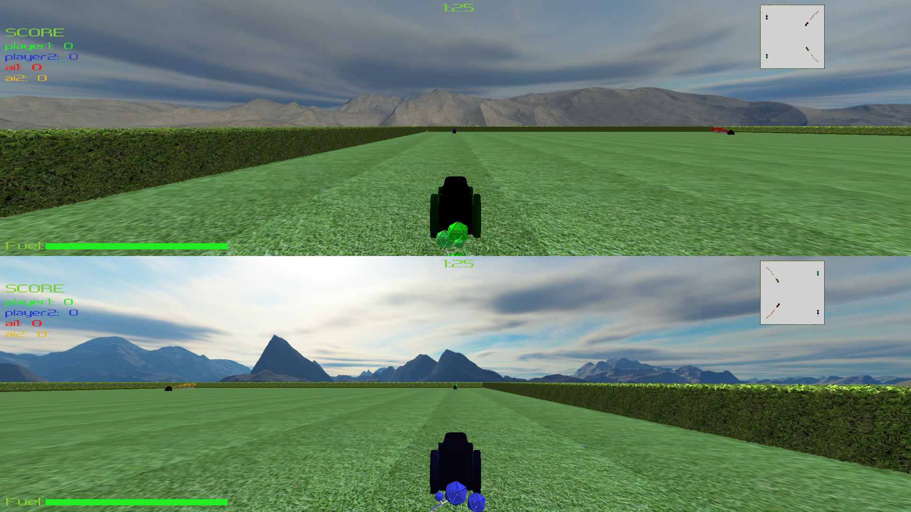

# Starlit-Thicket-Arena
**NOTE**: this repository does not contain assets (textures, audio, models) necessary to build the entire project.

# Demo

Here is a [link](https://www.youtube.com/watch?v=F-NbZPO1jzI) to a video demo showing some of the game features.

# Features
## Game Modes

- Permanent: this game mode leaves the trail until a player dies.
- Temporary: in this mode the trail slowly disappears.

## Players

The game supports single player

The game also supports two and four player modes (in each mode!)
